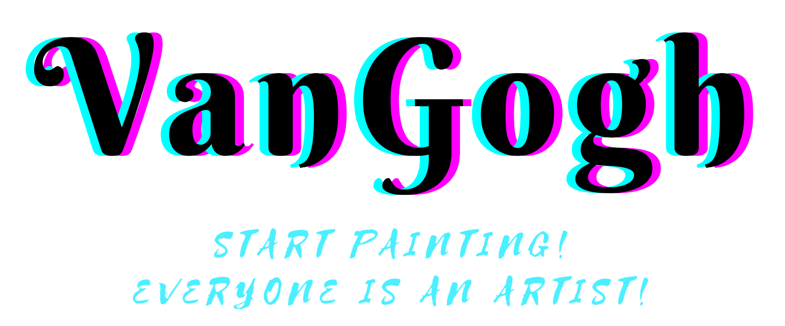

    
  

    一个使用flutter构建的人工智能绘画社区
     
    <a href="" target="blank"><strong>💾 还没想好</strong></a>&nbsp;&nbsp;|&nbsp;&nbsp;
    <a href="" target="blank"><strong>📦️ 还没想好</strong></a>&nbsp;&nbsp;|&nbsp;&nbsp;
    <a href="" target="blank"><strong>💬 还没想好</strong></a>
     
     
  

## :star2: 特性

- 使用flutter进行开发
- 设计风格使用material 3
- brarabrab
- 更多特性还在开发中

## 📦️ 如何使用

这里写如何安装整个项目

## ☑️ Todo

查看 Todo 请访问本项目的 [Projects](https://github.com/users/jwj1342/projects/4)

欢迎提 Issue 和 Pull request。

## ✍ 开发文档

这里放置相关的文档链接

## 🧑 特别鸣谢

## 📜 开源许可

本项目仅供个人学习研究使用，禁止用于商业及非法用途。

基于 [MIT license](https://opensource.org/licenses/MIT) 许可进行开源。
