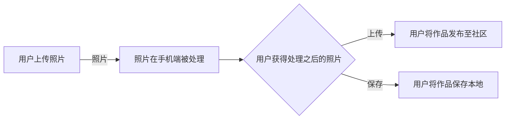
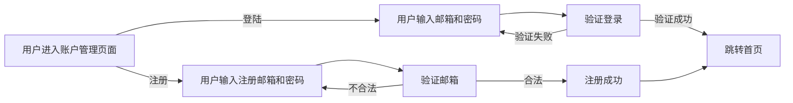

# 业务分析报告

## 业务介绍

### 前台介绍

我们的应用是一个基于风格迁移算法的图片生成和社交互动平台。用户可以使用我们的应用程序创建艺术风格的图片，并将它们分享到社区中以获取互动和反馈。此外，用户还可以了解各种不同的艺术风格和艺术家。

在前台只会有一种用户，其中该用户有两种操作是：

1. 图片生成操作：这是我们应用程序的主要用户。他们想要通过使用您的应用程序生成艺术风格的图片，这些图片可以包含自己的风景照片或其他图像。这些用户需要了解如何使用我们的应用程序来生成他们想要的艺术风格的图片。
2. 社交互动业务操作：这些用户对社区互动非常感兴趣。他们想要分享他们的艺术作品并获得反馈。他们需要一个账号来登陆到我们的应用程序，并与其他用户互动。有些用户还想要了解不同的艺术风格和艺术家。他们需要在您的应用程序中查看艺术家的作品、风格的发展历程等信息。

### 后台介绍

我们的应用程序还包括后台管理功能。管理员可以管理用户、发布通知、审核用户上传的图片等。此外，管理员还可以通过应用程序的后台来监控和管理服务器和数据库的运行状况，以确保应用程序的稳定性和安全性。

不同业务的用户：

1. 用户管理业务的用户：这些用户是负责管理用户账号和权限的管理员。他们需要审核新用户的注册信息，管理用户权限，解决用户的问题等。
2. 图片审核业务的用户：这些用户是负责审核用户上传的图片的管理员。他们需要审查上传的图片，确保图片不包含敏感内容，不侵犯版权等。

## 业务流程

1. 图片生成业务的流程：
   - 用户通过应用程序上传自己的照片或选择其他图像。
   - 用户选择所需的艺术风格，然后通过风格迁移算法将所选的艺术风格应用于图像。
   - 应用程序显示生成的图片，允许用户在必要时进行微调，然后保存图片到他们的设备上或者直接分享到社交媒体上。
2. 社交互动业务的流程：
   - 用户通过注册账号并登录到应用程序中。
   - 用户可以在社区中查看其他用户上传的图片并给出反馈，例如点赞、评论、分享等。
   - 用户可以在应用程序中浏览各种艺术家和不同的艺术风格的历史背景和特点。
   - 用户也可以上传他们自己的图片，并在社区中分享、展示和获取反馈。
3. 用户管理业务的流程：
   - 管理员审核新用户的注册信息，确保他们提供的信息是真实有效的，并核对他们的权限设置。
   - 管理员可以添加、编辑或删除用户账号，以及修改用户权限等设置。
   - 管理员也需要协调和解决用户在使用应用程序时遇到的任何问题和疑问。
4. 图片审核业务的流程：
   - 管理员负责审核用户上传的图片，确保它们不包含敏感信息、不侵犯版权、不涉及违法内容等。
   - 如果管理员发现不当内容，将对图片进行删除并且警告用户。

核心业务流程图：

用户登录流程图：

## 相关业务的数据

1. 图片生成业务的数据：
   - 用户上传的图片文件、图片文件格式、上传时间
   - 生成图片的风格、生成图片的质量
2. 社交互动业务的数据：
   - 用户上传的图片文件大小、文件格式、上传时间
   - 用户对其他用户图片的评论和点赞数，以及发布时间
   - 用户上传的自己的图片的点赞数、评论数、发布时间和标签等
   - 用户之间的私信和社区讨论的帖子内容、评论数和发布时间
3. 用户管理业务的数据：
   - 用户的注册信息、账号信息、个人资料和权限等信息
   - 管理员审核用户注册信息的结果、审核时间和审核人员等信息
4. 图片审核业务的数据：
   - 被审核的图片文件大小、文件格式、上传时间和上传者信息
   - 审核结果、审核时间和审核人员等信息