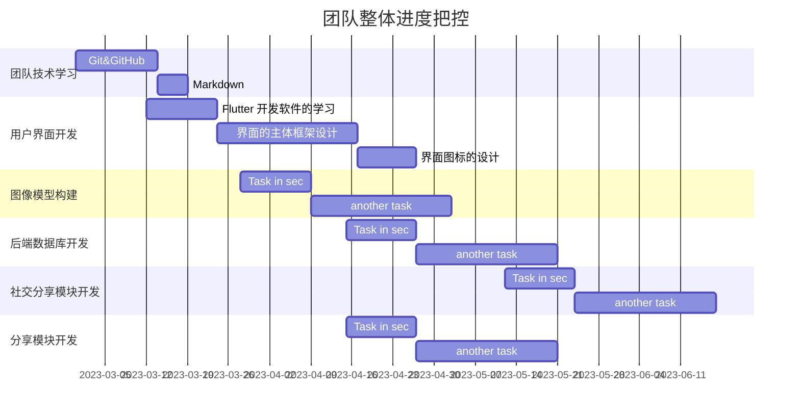

# 项目计划书

[toc]

## 引言

### 项目背景

随着人工智能的高速发展，现有的神经网络技术取得重大的突破。对抗生成网络（GAN）、风格迁移模型等大规模的模型的提出，让人工智能在图像领域取得了长足的进步与发展。社交网络快速发展，越来越多的人开始使用社交网络来分享自己的生活和见解，以及与他人交流和互动。通过将这些技术应用到社交网络上，可以为用户提供一种新颖的艺术和设计体验。人们对美学的需求不断提高，越来越多的人开始对艺术和设计产生兴趣，希望通过各种方式来欣赏和体验艺术和设计。

### 定义

|         涉及名词          |                             解释                             |
| :-----------------------: | :----------------------------------------------------------: |
|       对抗生成网络        | 生成对抗网络GAN（Generative adversarial nets）[1]是由Goodfellow等人于2014年提出的基于深度学习模型的生成框架，可用于多种生成任务。包含生成网络和判别网络，生成网络的作用是生成假数据以求骗过判别网络，而判别网络的作用是判定数据是真实数据的概率，通过对生成网络和判别网络的循环训练，可以得到生成效果较好的生成器。 |
|         风格迁移          | 风格迁移指两种不同风格的图像之间的风格转换，即给出一种风格的图像，可以将任意一种风格图像转化成这个风格并尽可能保留原图信息。 |
|   生成网络（Generator）   | G用于生成图片，其输入是一个随机的噪声z ，通过这个噪声生成图片，记作G ( z ) |
| 判别网络（Discriminator） | D用于判别一张图片是否是真实的，对应的，其输入是一整图片x，输出D ( x )表示的是图片x 为真实图片的概率。 |

### 参考文献

[1] Gatys, Leon A., Alexander S. Ecker, and Matthias Bethge. "A neural algorithm of artistic style." *arXiv preprint arXiv:1508.06576* (2015).

[2] Goodfellow, Ian, et al. "Generative adversarial networks." *Communications of the ACM* 63.11 (2020): 139-144.

[3] Tumanyan, Narek, et al. "Splicing vit features for semantic appearance transfer." *Proceedings of the IEEE/CVF Conference on Computer Vision and Pattern Recognition*. 2022.

[4] Arjovsky, M., Chintala, S., & Bottou, L. (2017). Wasserstein GAN. arXiv preprint arXiv:1701.07875.

[5] Mirza, M., & Osindero, S. (2014). Conditional generative adversarial nets. arXiv preprint arXiv:1411.1784.

[6] Radford, A., Metz, L., & Chintala, S. (2015). Unsupervised representation learning with deep convolutional generative adversarial networks. arXiv preprint arXiv:1511.06434.

[7] Zhu, J. Y., Park, T., Isola, P., & Efros, A. A. (2017). Unpaired image-to-image translation using cycle-consistent adversarial networks. In Proceedings of the IEEE international conference on computer vision (pp. 2223-2232).

[8] Mao, X., Li, Q., Xie, H., Lau, R. Y., Wang, Z., & Smolley, S. P. (2017). Least squares generative adversarial networks. In Proceedings of the IEEE international conference on computer vision (pp. 2794-2802).

[9] Gulrajani, I., Ahmed, F., Arjovsky, M., Dumoulin, V., & Courville, A. C. (2017). Improved training of Wasserstein GANs. In Advances in neural information processing systems (pp. 5767-5777).

[10] Denton, E. L., Chintala, S., Fergus, R., & Szlam, A. (2015). Deep generative image models using a Laplacian pyramid of adversarial networks. In Advances in neural information processing systems (pp. 1486-1494).

## 项目概述

### 工作内容

【简要说明项目的各项主要工作，介绍所开发软件的功能、性能等。】

1. 学习图像生成技术：该项目的核心是图像生成技术，需要有一定的机器学习、计算机视觉和图像处理基础，并熟悉一些常见的图像生成算法和技术，它旨在使用机器学习技术来从数据中生成虚拟图像，其中包含有用的信息，而这些信息可以用来改善诸如视觉检测、图像分类和图像生成等技术。例如卷积神经网络（CNN）、生成对抗网络（GAN）和风格迁移算法等。
2. 熟悉APP开发技术：该项目需要开发一个用户友好的APP界面和功能，熟悉相关开发语言（Java,swift）和相应的开发环境例（Android Studio,Xcode）；熟悉Android开发，了解Android框架，了解各种优化技术，以及常见的系统问题；熟悉swift语言，用swift进行项目开发和维护。
3. 理解社交分享功能：该项目需要开发社交分享功能，例如发现优质内容，如果发现了好东西，比如好商品、好音乐、好书籍、好电影等等，另外也要有项目特有的优质内容，比如网易云音乐的“评论”和微信读书的“想法”，用户自然会想要分享给身边的朋友。另外就是需要了解社交网络的基本概念和功能，例如用户之间的互动、评论和点赞等。
4. 熟悉数据库管理技术：该项目需要管理用户上传的图像和个人信息，需要掌握数据库管理软件的基本使用和构成，能够登录数据库管理软件，使用管理工具和命令对数据库进行创建、修改和删除。需要熟悉数据库管理技术，熟悉MySQL Workbrench工作环境、掌握在MySQL WorkBrench中使用工具和SQL命令创建、修改和删除数据库的方法。
5. 具备艺术史知识：该项目需要整合艺术家的绘画风格，需要了解一定的艺术史知识和绘画风格特点，例如梵高绘画作品的题材，他的作品中充满天然的悲悯情怀和苦难意识；然后是是色彩，梵高是一位色彩主义画家，他的画作中的色彩都是较为奔放、夸张的。了解这些之后以便更好地理解和应用艺术家的绘画风格。

### 产品

本项目最后交付可一个APK文件，内包含被编译的代码文件(.dex 文件)，文件资源（resources）， 原生资源文件（assets），证书（certificates），和清单文件（manifest file） 。

在开发的过程中将会在用户界面交互设计部分使用Java语法进行开发，在远端服务器上同样使用Java技术栈进行数据库等应用程序的操作，数据库使用的技术是MySql。

### 环境

该项目的开发环境为Android Stdiod等工具，主要操作系统为Win10 家庭版。

项目的使用平台是搭载了安卓系统的手机，对应的版本号>=7.0。

### 验收标准

1. 是否完成了软件主体的开发
2. 是否完成了对用户数据的后端数据库处理
3. 是否训练出可用的风格迁移算法
4. 各个子模块之间是否可以正常协同运行
5. 手机应用于云端通信是否有阻碍
6. 软件应该能够在合理的时间内完成图像转换
7. 软件应该具有良好的用户界面设计和易于使用的操作
8. 测试用例应覆盖所有软件功能，确保每个功能都可以正常工作
9. 测试用例应涵盖所有异常情况，例如输入无效图像或无法处理的格式
10. 转换后的图片质量应与输入图片相同或更好
11. 软件应该能够与用户进行交互.

### 项目模块

| 项目编号 | 项目主模块   | 项目分模块            | 项目模块描述                                                 |
| -------- | ------------ | --------------------- | ------------------------------------------------------------ |
| 1        | 用户信息模块 | 注册模块              | 该模块允许新用户创建账户并对其输入的用户名、密码、电话等进行验证。验证通过后，创建新账号并将信息存储在数据库中。 |
| 2        |              | 登录模块              | 该模块允许已注册用户通过输入其用户名和密码来登录账户。如果输入的信息正确，用户将被授权访问他们的账户。 |
| 3        |              | 找回密码模块          | 该模块允许用户重置密码。该模块可继续细分为密码重置请求，密码重置验证，密码重置成功/失败提示。 |
| 4        |              | 查看/修改个人信息模块 | 该模块允许用户查看和修改个人信息，例如头像，电话，昵称，个人简介等。用户可以通过该模块更新账户信息或注销个人账户。 |
| 5        |              | 动态记录模块          | 该模块允许用户记录发布过的动态和收藏的作品。用户可以通过该模块对动态进行删除操作或对收藏的作品进行取消收藏操作。 |
| 6        |              | 关注管理模块          | 该模块允许用户管理自己关注的人和被关注的人，包括添加、取消关注等操作。 |
| 7        | 图像生成模块 | 云端图像管理模块      | 该模块通过云端存储服务对图像资源进行存储、访问、管理、维护和监控操作，确保图像资源在云端的安全性和可靠性。 |
| 8        |              | 图像生成风格选择模块  | 该模块允许用户选择所需图像的生成风格。用户可以根据自己的需求和喜好选择不同的图像生成风格。 |
| 9        |              | 图像处理模块          | 该模块通过分析用户所选的的图像生成风格对图像进行处理，生成对应风格的图像。 |
| 10       |              | 图像编辑模块          | 该模块允许用户对生成的图像进行压缩、格式转换、裁剪、调整、旋转、缩放、镜像等操作。 |
| 11       | 社交分享模块 | 分享模块              | 该模块支持用户将自己生成的图片发布到平台上。                 |
| 12       |              | 交互模块              | 该模块允许用户关注其他博主或点赞、评论、收藏自己感兴趣的图片。 |
| 13       |              | 社交动态模块          | 该模块用于显示用户关注的人发布的最新动态。                   |
| 14       |              | 推荐系统模块          | 该模块通过推荐引擎，基于用户行为、兴趣、偏好等信息，通过特定的算法和模型，自动为用户推荐可能感兴趣的内容和信息。 |
| 15       |              | 热点模块              | 该模块用于展示当前热门的图像，比如点赞多，评论多或者收藏多的图像。 |
| 16       | 用户界面模块 | UI设计模块            | 该模块主要用于设计APP的界面，包括界面的布局、配色、字体等。  |
| 17       |              | 交互设计模块          | 该模块主要用于设计APP的交互功能，包括按钮、文本框、下拉框等交互元素的设计。 |
| 18       |              | 响应式设计模块        | 该模块主要用于设计APP在不同设备上的显示效果，包括PC、平板和手机等。该子模块需要考虑不同屏幕尺寸对用户体验的影响，并进行适配。 |
| 19       |              | 图标设计              | 该模块主要用于设计APP中的图标，包括APP图标、菜单图标等。     |

## 实施计划

### 风险预估

由于团队成员缺乏团队开发经验，对于相关技术的了解不多，因此存在技术风险和进度风险，而且是技术风险导致进度风险的可能性比较大。进度风险主要是系统实现阶段和测试阶段进度，可能表现为编码工作进展不顺利、各个子系统模块之间的链接存在问题、数据库系统与网站之间的传输连接稳定性以及测试结果不符合预定要求等问题导致的进度拖后问题。

除此之外，在开发风格迁移的神经网络的过程中，很有可能出现计算量过大，导致系统资源无法调配，此时需要对网络架构进行压缩。具体可能导致项目进度减缓或者开发受阻。

### 人员组织及分工

为了很好地完成本项目，我们成立了由七个人组成的项目团队，根据需求分析和开发进度计划，我们的成员分工如下表所示：

|  成员  |                    主要任务                    |         角色         |
| :----: | :--------------------------------------------: | :------------------: |
| 蒋文嘉 | 安排项目分工、控制项目进度、整体把控项目的架构 | 项目经理、设计、编码 |
| 郑宇婷 | 完成主要功能的部分开发并且完成界面的设计与开发 |   美工、编码、文档   |
| 温云开 | 完成主要功能的部分开发并且完成界面的设计与开发 |   设计、编码、文档   |
| 张馨丹 | 完成主要功能的部分开发并且完成界面的设计与开发 |   美工、编码、文档   |
| 刘硕士 |   完成程序核心功能的网络构建，完成模型的迁移   |   设计、编码、文档   |
| 戴逸蒙 | 完成主要功能的部分开发并且完成界面的设计与开发 |   测试、编码、文档   |
| 高小茜 | 完成主要功能的部分开发并且完成界面的设计与开发 |   美工、编码、文档   |

### 进度

### 协作与沟通

在本次项目开发过程中，对于代码部分的协作，我们对于每个人的开发都是用git进行管理，与CVS、Subversion一类的集中式版本控制工具不同，它采用了分布式版本库的作法，不需要服务器端软件，就可以运作版本控制，使得源代码的发布和交流极其方便。在每个成员的本地仓库代码编写完毕以后，上传至Github，有组长对代码进行审查和合并。

团队成员直接通过QQ等即时聊天工具、腾讯会议或者机房面对面进行沟通。会议讨论时时限安排为每周一次，讨论的内容主要包括关于项目做出的新的变动或调整，上一阶段任务完成情况的统计以及总结，下一个阶段任务的详细安排和准备。

### 关键问题

1. 训练出具有风格迁移功能的生成对抗神经网络
2. 开发出美观的UI
3. 用户的数据库构建
4. 前后端数据的交互
5. 对用户上传不良内容或敏感图片的识别
6. 生成图像的版权保护（商用/社交分享）
7. 利用Android开发对用户友好的使用界面
8. 为作品添加关键词标签用于分类检索
9. 对于数据库存储大量用户作品的存储管理
10. 实时更新作品库及社区资讯
11. 定期更新艺术家风格，提供更多选择

## 交付期限

2023年6月30日

